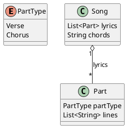

# Sing‑It Project Planning

## Overview
Sing‑It is an iOS app for creating, organizing, and playing song sets (e.g., for worship or performance). It supports two layout modes:

- **Storyboard mode**: visually arrange UI in Interface Builder, connect via IBOutlets/IBActions.
- **Programmatic mode**: build and style views entirely in code using a flag (`useCodeLayout`).

## Architecture

### Models
- **Song**: contains a sequence of lyric parts and chord data.
- **Part**: represents a section of lyrics (Verse or Chorus) with multiple lines.
- **PartType**: enum listing `Verse` and `Chorus`.

#### PlantUML Diagram

## UI Flow

### Start Page
- Title: **Sing‑It**
- Buttons:
  - Create Song
  - Create Set
  - Play Set

Layout can be toggled:
1. **Storyboard mode**: arrange the stack view, label, and buttons in Main.storyboard and style in `styleStoryboardUI()`.
2. **Programmatic mode**: build them in `buildCodeUI()` when `useCodeLayout = true`.

## Next Steps
1. Implement screens for “Create Song”, “Create Set”, and “Play Set”.
2. Persist songs and sets (e.g., JSON, Core Data).
3. Add navigation controllers and UI flows.
4. Enhance styling (custom fonts, themes).
5. Write unit and UI tests.
6. Consider SwiftUI preview or `@IBDesignable` for live canvas rendering.
